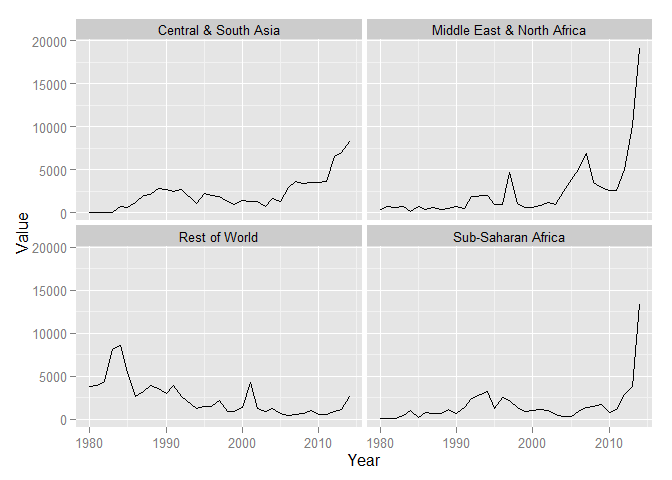
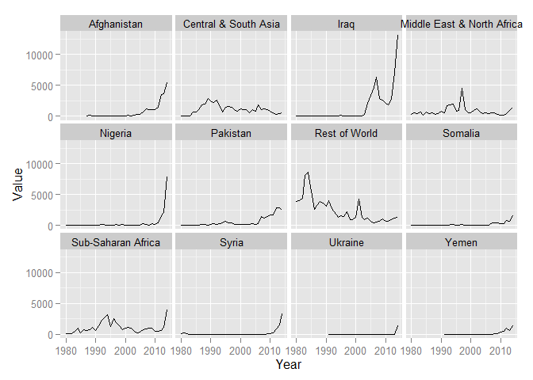
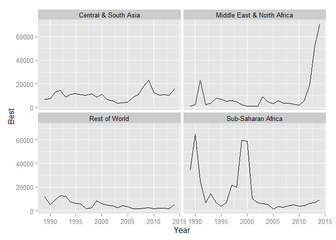
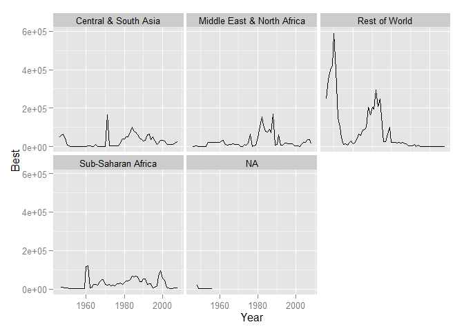
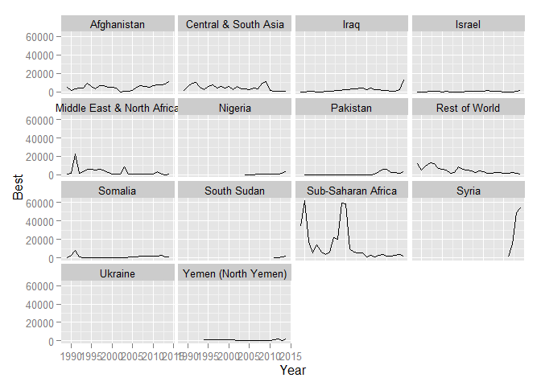
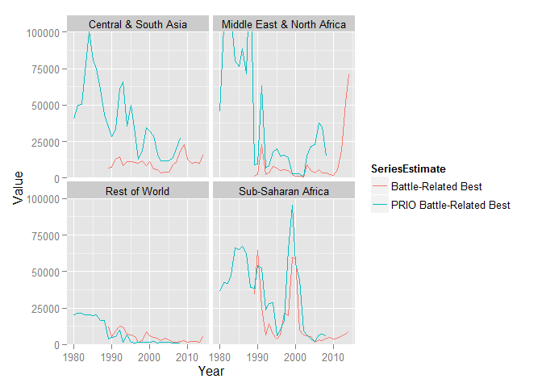
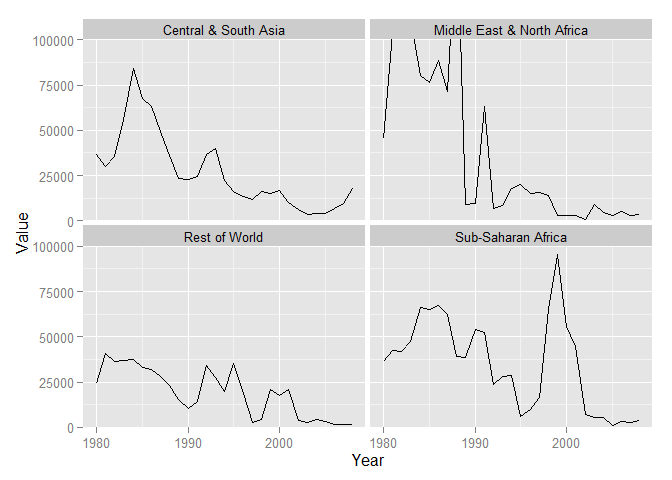
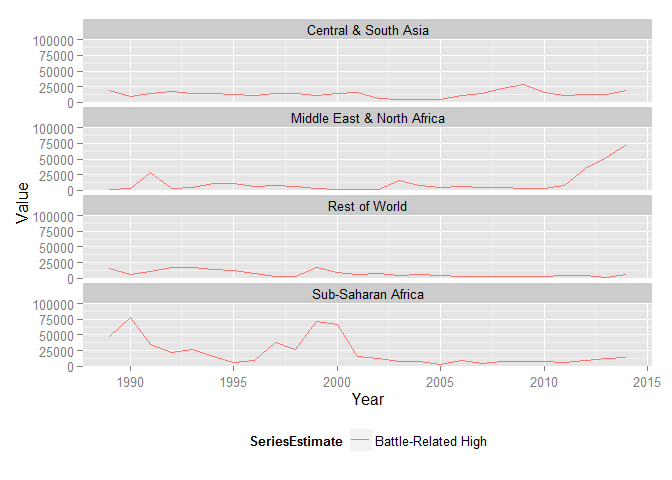
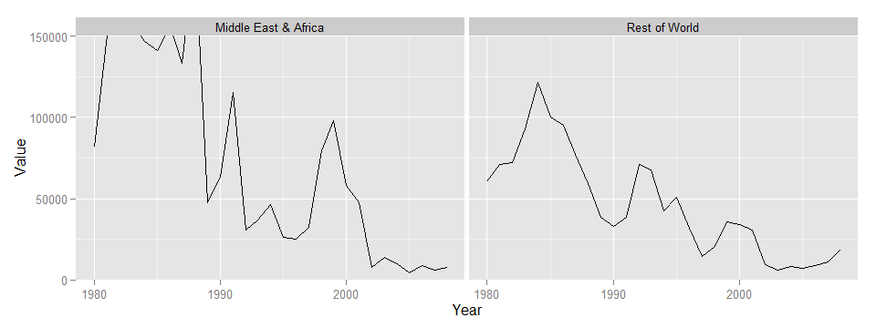
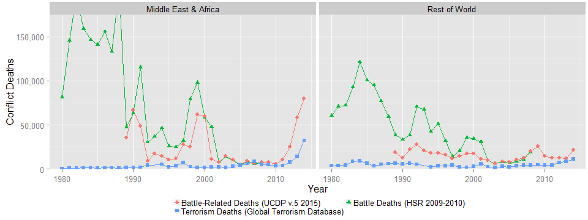

# Terrorism
Greg Sanders  
December 10, 2015  

This is an R Markdown document. Markdown is a simple formatting syntax for authoring HTML, PDF, and MS Word documents. For more details on using R Markdown see <http://rmarkdown.rstudio.com>.

When you click the **Knit** button a document will be generated that includes both content as well as the output of any embedded R code chunks within the document. You can embed an R code chunk like this:


```r
setwd("K:\\Development\\Conflict")
Path<-"K:\\2007-01 PROFESSIONAL SERVICES\\R scripts and data\\"
source(paste(Path,"helper.r",sep=""))
```

```
## Loading required package: ggplot2
## Loading required package: grid
## Loading required package: scales
## Loading required package: reshape2
## Loading required package: plyr
## Loading required package: lubridate
## 
## Attaching package: 'lubridate'
## 
## The following object is masked from 'package:plyr':
## 
##     here
```

```r
source(paste(Path,"lookups.r",sep=""))
```

```
## Loading required package: stringr
```

```r
require(plyr)
require(ggplot2)

load("data//124934_1ucdp-brd-conflict-2015.rdata")
ucdp.brd<-standardize_variable_names(Path,ucdp.brd)
ucdp.brd<-read_and_join("","ucdpCountry.csv",ucdp.brd,by="GWNoLoc")
ucdp.brd$BdLow[ucdp.brd$BdLow=="-99"]<-NA
ucdp.brd$BdBest[ucdp.brd$BdBest=="-99"]<-NA
ucdp.brd$BdHigh[ucdp.brd$BdHigh=="-99"]<-NA


any(is.na(ucdp.brd$BdLow))
```

```
## [1] TRUE
```

```r
terrorism.df <- read.csv("data//globalterrorismdb_0615dist.csv")
terrorism.df<-standardize_variable_names(Path,terrorism.df)
terrorism.df$Value<-FactorToNumber(as.character(terrorism.df$nkill))
# terrorism.df<-ddply(terrorism.df,
#                     .(Region,
#                       Year,
#                       country     ,
#                       country_txt    ,
#                       region_txt      ,         
#                       doubtterr),
#                     summarise,
#                     
#                     nkill=sum(nkill),
#                     nkillus=sum(nkillus),
#                     nkillter=sum(nkillter),
#                     nwound=sum(nwound),
#                     nwoundus=sum(nwoundus),
#                     nwoundte=sum(nwoundte)
# )
terrorism.df<-read_and_join("","STARTcountry.csv",terrorism.df,by="country")


prio.df <- read.csv("data//PRIO_bd3.0.csv",na.strings=c("NA","-999"))
prio.df<-standardize_variable_names(Path,prio.df)
prio.df<-read_and_join("","prioCountry.txt",prio.df,by="gwnoloc")

#Impute low values when best cannot be determined.
prio.df$bdeadbes[is.na(prio.df$bdeadbes)]<-(prio.df$bdeadlow[is.na(prio.df$bdeadbes)]+prio.df$bdeadhig[is.na(prio.df$bdeadbes)])/2


hsr.df <- read.csv("data//20092010Report_Data10_4_ReportedBattleDeathsFromStateBasedArmedConflicts1946-2008.csv")
hsr.df<-standardize_variable_names(Path,hsr.df)

hsr.df <- melt(data=hsr.df,id.var=c("Year"),
               variable.name="Region",
               value.name="Value")
```

```
## Warning: attributes are not identical across measure variables; they will
## be dropped
```

```r
hsr.df$Value<-FactorToNumber(as.character(hsr.df$Value))
hsr.df<-read_and_join("","HSRregion.txt",hsr.df)
```

```
## Joining by: Region
```

You can also embed plots, for example:

 

```
## [1] 0.8342025
```

 

```
## [1] 0.2118112
```

```
## [1] 7820.33
```

```
##     Year              RegionSummary    Value
## 171 2014       Central & South Asia  8353.33
## 172 2014 Middle East & North Africa 19146.49
## 173 2014              Rest of World  2684.00
## 174 2014         Sub-Saharan Africa 13328.18
```


  

```
##         gwnoloc id Year bdeadlow bdeadhig bdeadbes annualdata source
## 335 6.51646e+17 30 1948     7218    19792    19792          1      1
## 336 6.51646e+17 30 1949      482     1319     1319          1      1
## 586 6.51221e+11 55 1956     1865     3000     2142          2      1
##     bdversion                          sidea sidea2nd
## 335         3                         Israel         
## 336         3                         Israel         
## 586         3 France, Israel, United Kingdom         
##                                   sideb sideb2nd incomp      terr int
## 335 Egypt, Iraq, Jordan, Lebanon, Syria               1 Palestine   2
## 336 Egypt, Iraq, Jordan, Lebanon, Syria               1 Palestine   1
## 586                               Egypt               1      Suez   2
##     cumint type  startdate startprec startdate2 startprec2 epend ependdate
## 335      1    2  4/15/1948         1  4/15/1948          1     0          
## 336      1    2  4/15/1948         1  4/15/1948          1     1  1/7/1949
## 586      1    2 10/31/1956         1 10/31/1956          1     1 11/6/1956
##     ependprec     gwnoa gwnoa2nd       gwnob gwnob2nd version location
## 335        NA       666       NA 6.51646e+14       NA  2009-4     <NA>
## 336       -99       666       NA 6.51646e+14       NA  2009-4     <NA>
## 586       -99 220666200       NA 6.51000e+02       NA  2009-4     <NA>
##     Region RegionName RegionSummary Notes
## 335     NA       <NA>          <NA>  <NA>
## 336     NA       <NA>          <NA>  <NA>
## 586     NA       <NA>          <NA>  <NA>
```

```
## [1] 0.9565903
```

```
## [1] 0.9237323
```

 


```r
ucdp.brdDyad$Series<-"Battle-Related"
prio.brdDyad$Series<-"PRIO Battle-Related"

Joint<-rbind(ucdp.brdDyad,prio.brdDyad)
colnames(ucdp.brdDyad)
```

```
## [1] "Year"          "RegionSummary" "Best"          "Low"          
## [5] "High"          "Series"
```

```r
colnames(prio.brdDyad)
```

```
## [1] "Year"          "RegionSummary" "Best"          "Low"          
## [5] "High"          "Series"
```

```r
TotalDyad<-ddply(Joint,
                 .(Year,RegionSummary,Series),
                 summarise,
                 Best=sum(Best,na.rm=TRUE),
                 High=sum(High,na.rm=TRUE),
                 Low=sum(Low,na.rm=TRUE)
)

TallTotalDyad<-melt(TotalDyad,
                    id.vars = c("Year","RegionSummary","Series"),
                    value.name = "Value",
                    variable.name = "Estimate"
)

TallTotalDyad$SeriesEstimate<-factor(paste(TallTotalDyad$Series,TallTotalDyad$Estimate))

c("Battle-Related Best", 
  "Battle-Related High", 
  "Battle-Related Low",
  "PRIO Battle-Related Best",
  "PRIO Battle-Related High",
  "PRIO Battle-Related Low")
```

```
## [1] "Battle-Related Best"      "Battle-Related High"     
## [3] "Battle-Related Low"       "PRIO Battle-Related Best"
## [5] "PRIO Battle-Related High" "PRIO Battle-Related Low"
```

```r
ggplot(data=subset(TallTotalDyad,Year>=1980 &
                       SeriesEstimate %in% c("Battle-Related Best", 
                                             # "Battle-Related High", 
                                             # "Battle-Related Low",
                                             "PRIO Battle-Related Best"
                                             # "PRIO Battle-Related High",
                                             # "PRIO Battle-Related Low"
                       )),
       aes(x=Year,
           y=Value,
           color=SeriesEstimate
       )
)+geom_line(stat="identity")+
    facet_wrap( ~RegionSummary)+
    coord_cartesian(ylim = c(0,100000))
```

 


```r
hsr.df$SeriesEstimate<-"Battle Deaths (HSR 2009-2010)"
    #"Battle Deaths, Human Security Report 2009-2010: The Causes of Peace and The Shrinking Costs of War, 1980-2008"

hsrRegion.df<-ddply(hsr.df,
              .(Year,RegionSummary,SeriesEstimate),
              summarise,
              Value=sum(Value))

ggplot(data=subset(hsrRegion.df,Year>=1980),
          aes(x=Year,
           y=Value
       )
)+geom_line(stat="identity")+
    facet_wrap( ~RegionSummary)+
    coord_cartesian(ylim = c(0,100000))
```

 

```r
colnames(TallTotalDyad)
```

```
## [1] "Year"           "RegionSummary"  "Series"         "Estimate"      
## [5] "Value"          "SeriesEstimate"
```

```r
colnames(terrorRegionDyad)
```

```
## [1] "Year"          "RegionSummary" "Value"
```

```r
terrorRegionDyad$SeriesEstimate<-"Terrorism Deaths, National Consortium for the Study of Terrorism and Responses to Terrorism (START). (2013)."
BRD.Joint<-rbind(hsrRegion.df,subset(TallTotalDyad,select = -c(Series,Estimate)),terrorRegionDyad)
ggplot(data=subset(BRD.Joint,Year>=1980 &
                    SeriesEstimate %in% c(
                        # "Battle-Related Best", 
                                             "Battle-Related High", 
                                             # "Battle-Related Low",
                                           "Battle Deaths, Human Security Report 2009-2010: The Causes of Peace and The Shrinking Costs of War",
                                          "Terrorism"
                                          
                                             # "PRIO Battle-Related Best"
                                             # "PRIO Battle-Related High",
                                             # "PRIO Battle-Related Low"
                                          
                                          )),
          aes(x=Year,
           y=Value,
           color=SeriesEstimate
       )
)+geom_line(stat="identity")+
    facet_wrap( ~RegionSummary,ncol=1)+
    coord_cartesian(ylim = c(0,100000))+
    theme(legend.position="bottom")
```

 

```r
summary(hsrRegion.df        )
```

```
##       Year      RegionSummary      SeriesEstimate         Value       
##  Min.   :1946   Length:252         Length:252         Min.   :     0  
##  1st Qu.:1961   Class :character   Class :character   1st Qu.:  3702  
##  Median :1977   Mode  :character   Mode  :character   Median : 17730  
##  Mean   :1977                                         Mean   : 40748  
##  3rd Qu.:1993                                         3rd Qu.: 38723  
##  Max.   :2008                                         Max.   :590330
```


```r
hsrSplitDyad<-ddply(hsr.df,
              .(Year,RegionSplit,SeriesEstimate),
              summarise,
              Value=sum(Value))

#"Battle-Related Deaths Dataset Uppsala Conflict Data Program v.5-2015, 1989-2014"
ucdp.brd$SeriesEstimate<-"Battle-Related Deaths (UCDP v.5 2015)"
ucdp.brdSplitDyad<-ddply(ucdp.brd,
                    .(Year, RegionSplit,SeriesEstimate),
                    summarise,
                    Value=sum(BdBest,na.rm=TRUE),
                    Low=sum(BdLow,na.rm=TRUE),
                    High=sum(BdHigh,na.rm=TRUE)
)
#Region
terrorSplitDyad<-ddply(terrorism.df,
                        .(Year,RegionSplit),
                        summarise,
                        Value=sum(nkill,na.rm=TRUE))
terrorSplitDyad$SeriesEstimate<-"Terrorism Deaths (Global Terrorism Database)"
#National Consortium for the Study of Terrorism and Responses to Terrorism (Global Terrorism Database). (2013)."


ggplot(data=subset(hsrSplitDyad,Year>=1980),
          aes(x=Year,
           y=Value
       )
)+geom_line(stat="identity")+
    facet_wrap( ~RegionSplit)+
    coord_cartesian(ylim = c(0,150000))
```

 

```r
colnames(terrorSplitDyad)
```

```
## [1] "Year"           "RegionSplit"    "Value"          "SeriesEstimate"
```

```r
SplitConflictTrends<-rbind(hsrSplitDyad,subset(ucdp.brdSplitDyad,select = -c(High,Low)),terrorSplitDyad)
colnames(SplitConflictTrends)
```

```
## [1] "Year"           "RegionSplit"    "SeriesEstimate" "Value"
```

```r
ggplot(data=subset(SplitConflictTrends,Year>=1980 ),
          aes(x=Year,
           y=Value,
           color=SeriesEstimate
           
       )
)+geom_line(stat="identity")+geom_point(stat="identity", aes(shape=SeriesEstimate))+
    facet_wrap( ~RegionSplit,ncol=2)+
    coord_cartesian(ylim = c(0,175000))+
    theme(legend.position="bottom")+#ggtitle(VAR.main.label)+
        ylab("Conflict Deaths")+
        guides(color=guide_legend(nrow=2,title=NULL,byrow=TRUE),
               shape=guide_legend(nrow=2,title=NULL,byrow=TRUE))+ 
    scale_y_continuous(labels = comma)+theme(plot.margin = unit(c(0.1,0.1,0.1,0.1), "cm"))+
        theme(legend.margin = unit(-0.5, "cm"))+
        theme(legend.key.size = unit(0.25, "cm"))
```

 

```r
    # geom_ribbon(aes(ymin=UCDP,ymax=HSR),alpha=0.25)
summary(hsrRegion.df        )
```

```
##       Year      RegionSummary      SeriesEstimate         Value       
##  Min.   :1946   Length:252         Length:252         Min.   :     0  
##  1st Qu.:1961   Class :character   Class :character   1st Qu.:  3702  
##  Median :1977   Mode  :character   Mode  :character   Median : 17730  
##  Mean   :1977                                         Mean   : 40748  
##  3rd Qu.:1993                                         3rd Qu.: 38723  
##  Max.   :2008                                         Max.   :590330
```
